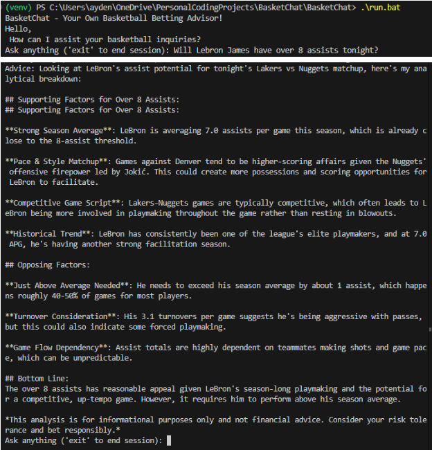
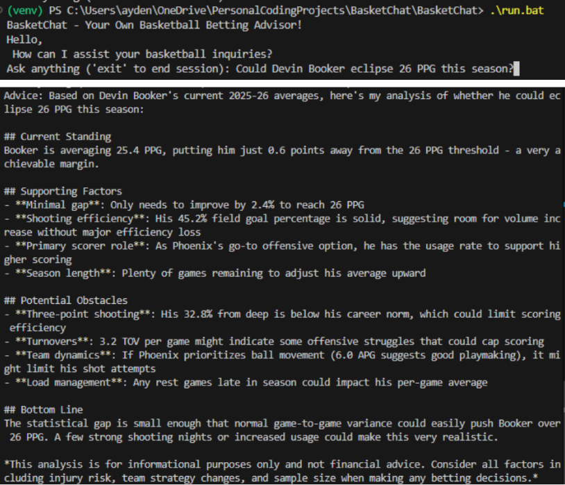

# 🏀 BasketChat - Your Basketball Betting Advisor

A terminal-based AI assistant that provides data-driven insights for NBA betting decisions. Ask about player props, team matchups, and more. BasketChat pulls live 2025-26 season stats and uses Claude AI to give you analytical breakdowns.

> **Disclaimer:** For informational and entertainment purposes only. Not financial advice.

---

## Demo

 

*Example queries:*
- "Will LeBron James have over 8 assists tonight?"
- "Could Devin Booker eclipse 26 PPG this season?"

---

## Features

- 💬 Terminal chat interface — ask questions in plain English
- 📊 Live 2025-26 NBA player stats via the NBA API
- 🏀 Tonight's matchup detection for any team
- 🤖 Betting insights powered by Claude (Anthropic)
- 🔍 Automatic player and team name extraction from your message

---

## Tech Stack

- **Language:** Python 3.12
- **AI:** Anthropic Claude API (claude-sonnet-4-20250514)
- **Sports Data:** nba_api (official NBA stats)
- **Libraries:** `anthropic`, `nba_api`, `python-dotenv`

---

## Project Structure

```
BasketChat/
├── assets/
│   ├── LeBron8astExample.png
│   └── Booker26ppgExample.png
├── backend/
│   ├── main.py              # Terminal chat loop
│   ├── chat.py              # Extracts player/team names from messages using Claude
│   ├── llm.py               # Claude API integration and system prompt
│   ├── sports_api.py        # NBA stats and matchup fetching
│   └── prompt_builder.py    # Combines user question + stats into a prompt
├── run.bat                  # Windows one-click startup script
├── .env.example             # Environment variable template
├── requirements.txt
└── README.md
```

---

## How It Works

```
User types a question
        ↓
chat.py extracts player/team name using Claude
        ↓
sports_api.py fetches live 2025-26 stats from NBA API
        ↓
prompt_builder.py combines question + stats into a prompt
        ↓
llm.py sends prompt to Claude and gets betting insight back
        ↓
Response printed to terminal
```

---

## Setup

### 1. Clone the repo
```bash
git clone https://github.com/AydenTaylor10/BasketChat.git
cd BasketChat
```

### 2. Create a virtual environment with Python 3.12
```bash
py -3.12 -m venv venv
venv\Scripts\activate
```

### 3. Install dependencies
```bash
pip install -r requirements.txt
```

### 4. Add your API key
```bash
cp .env.example .env
```
Open `.env` and fill in your Anthropic API key:
```
ANTHROPIC_API_KEY=your_key_here
```
Get your key at: https://console.anthropic.com

> No API key needed for NBA stats — the nba_api library is free with no authentication required.

### 5. Run the program
```bash
.\run.bat
```
Or manually:
```bash
cd backend
python main.py
```

---

## Example Questions
- "Will LeBron James score over 25 points tonight?"
- "Should I bet on the Lakers to win against Denver?"
- "Will Steph Curry go over 4 three pointers tonight?"
- "Could Devin Booker eclipse 26 PPG this season?"
- "Will Nikola Jokic have a triple double tonight?"

---

## Notes
- Requires Python 3.12 specifically (3.13+ not yet supported by some dependencies)
- NBA API can occasionally be slow as it pulls directly from the official NBA stats website
- Stats reflect the current 2025-26 NBA season
